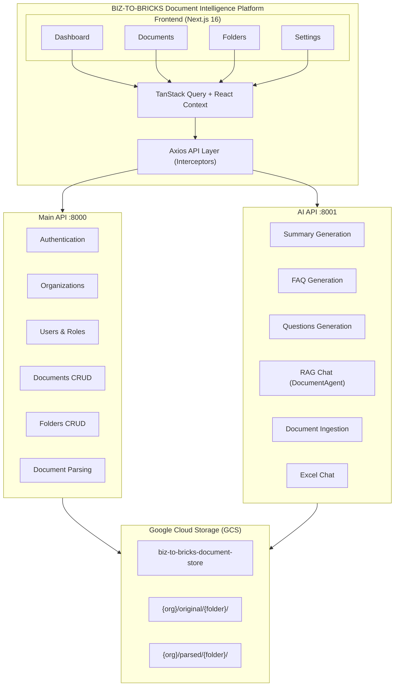
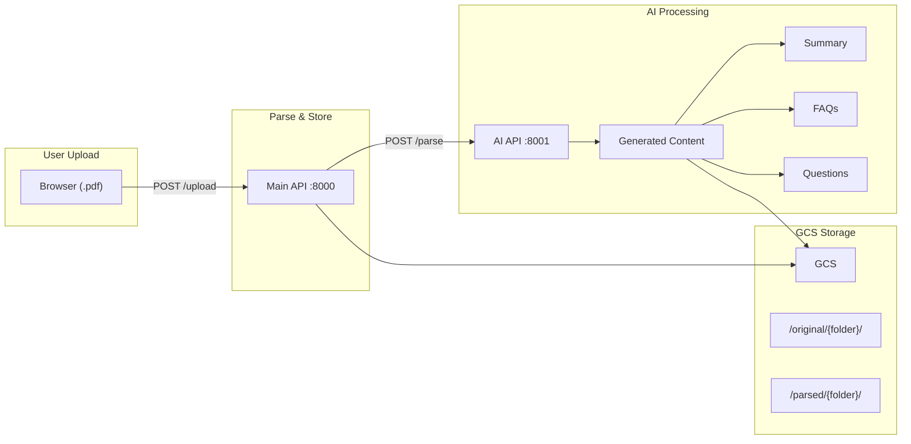
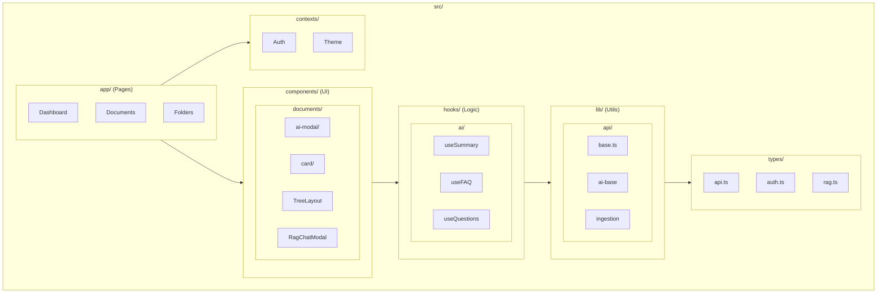

# Biz-To-Bricks | Document Intelligence Platform

A modern, AI-powered document management and intelligence platform designed specifically for small businesses. Built with Next.js 16.0.10, React 19.2.3, TypeScript, and Tailwind CSS 4.1.18 with comprehensive authentication and role-based access control.

## 🌟 Overview

Biz-To-Bricks provides intelligent document processing with AI-powered analysis, multi-API integration (Main API, Excel API, RAG API, Ingestion API), and advanced features like document parsing, summarization, FAQ generation, and questions generation. The platform supports JWT-based authentication, role-based access control, and GCS bucket storage for enterprise-grade document management.

## 🚀 Features

### 🤖 AI-Powered Document Intelligence

-   **Advanced Document Parsing**: Extract and edit text content from PDFs with markdown preview and syntax highlighting
-   **AI Content Generation**: Generate summaries, FAQs, and questions from document content
-   **RAG (Retrieval-Augmented Generation)**: Chat with documents using advanced AI retrieval systems
-   **Gemini Semantic Search**: Multi-tenant semantic search with hybrid modes
    -   Search modes: Semantic, Keyword, or Hybrid
    -   Search scopes: Single file, folder, or org-wide
    -   Answer generation with citations
    -   Session-based search history
-   **Excel Integration**: Specialized AI chat functionality for Excel documents
-   **Content Metadata Extraction**: Intelligent extraction of document metadata and structure
-   **Multi-Format Support**: Process various document types with specialized handlers

### 📁 Document Management

-   **Interactive Document Editor**: Split-view editor with live markdown preview for parsed content
-   **Folder-Based Organization**: Structured document storage with mandatory folder organization
-   **GCS Bucket Integration**: Enterprise-grade storage with `biz-to-bricks-document-store`
-   **Document Status Tracking**: Real-time processing status (pending → processing → completed/failed)
-   **File Upload & Management**: Drag-and-drop interface with progress tracking and folder organization
-   **Document Versioning**: Track changes and maintain document history

### 🔐 Authentication & Security

-   **JWT Authentication**: Secure token-based authentication with automatic refresh
-   **Role-Based Access Control**: Admin/user roles with granular permissions
-   **Route Protection**: Middleware-based authentication and navigation control
-   **Multi-Tenant Support**: Organization-based access control and data isolation
-   **Session Management**: Configurable session timeouts and security policies

### 🏢 Enterprise Features

-   **Organization Management**: Multi-tenant organization support with admin controls
-   **User Profile System**: Complete profile management with organization details and fallback API patterns
-   **Settings Management**: Comprehensive settings for account, organization, and application
-   **Real-time Dashboard**: Live insights and analytics for document processing
-   **Admin Panel**: User management, organization settings, and system administration

### 🎨 Modern UI/UX

-   **Dark Mode Support**: System-aware theme switching (light/dark/system) via ThemeContext
-   **Responsive Design**: Optimized for desktop, tablet, and mobile workflows
-   **Accessibility**: WCAG-compliant design with keyboard navigation and screen reader support
-   **Design System**: Consistent Tailwind CSS components with Inter/Poppins typography
-   **Loading States**: Sophisticated loading indicators and progress tracking
-   **Toast Notifications**: Real-time feedback with React Hot Toast integration
-   **Modal Systems**: Advanced modal architecture for document operations
-   **Rich Text Editor**: TipTap-based editor with tables support for document editing
-   **Tree Layouts**: Hierarchical folder navigation with collapsible sidebar

### 🔗 Simplified 2-API Architecture

-   **Main API** (`localhost:8000`): Core platform functionality (auth, documents, folders, users)
-   **AI API** (`localhost:8001`): All AI services including:
    -   Document summarization (`/api/v1/documents/summarize`)
    -   FAQ generation (`/api/v1/documents/faqs`)
    -   Questions generation (`/api/v1/documents/questions`)
    -   RAG chat (`/api/v1/simple-rag`)
    -   Document ingestion (`/api/v1/ingest`)
    -   Excel chat

## 🏗️ Architecture

### Core Technology Stack

-   **Frontend Framework**: Next.js 16.0.10 with App Router and Turbopack for lightning-fast development
-   **React Runtime**: React 19.2.3 with modern features (Concurrent Rendering, Server Components)
-   **Type Safety**: Full TypeScript implementation with comprehensive type definitions
-   **Styling**: Tailwind CSS with custom design system (Inter/Poppins typography)
-   **Build Tool**: Turbopack for optimized development and production builds

### System Architecture Diagram



### Document Processing Flow



### Frontend Component Architecture



### State Management & Data Flow

-   **Server State**: TanStack Query (React Query) v5 for caching, synchronization, and background updates
-   **Authentication State**: React Context with useReducer for predictable auth state management
-   **Form State**: React Hook Form with validation and error handling
-   **Local State**: React hooks with optimistic updates and error boundaries

### API & Network Layer

-   **HTTP Client**: Axios with centralized client factory (`src/lib/api/client-factory.ts`)
-   **Authentication**: JWT Bearer tokens with automatic refresh mechanism
-   **Timeouts**: All API operations use 2-minute timeout (configurable in `constants.ts`)
-   **Error Handling**: Centralized error handling with user-friendly messages
-   **API Architecture**: RESTful APIs with snake_case/camelCase conversion
-   **Dual-API Integration**: Simplified 2-URL pattern with dedicated clients for Main API and AI API

### Centralized Constants (`src/lib/constants.ts`)

All configuration values are centralized for maintainability:
-   **TIMEOUTS**: API timeouts (all 2 minutes), diagnostics, session cleanup
-   **STORAGE_KEYS**: localStorage keys for auth tokens, sidebar state, theme
-   **LAYOUT**: Navbar height, sidebar dimensions, responsive breakpoints
-   **FILE_EXTENSIONS/MIME_TYPES**: Supported file types for upload
-   **UPLOAD_LIMITS**: Max file size, max files per upload
-   **AI_LIMITS**: Summary word limits, FAQ/questions count limits

### Security & Route Protection

-   **Authentication**: JWT-based with Bearer tokens stored in localStorage via AuthTokenManager
-   **Route Protection**: Next.js middleware with role-based access control
-   **API Security**: Automatic token injection and refresh via Axios interceptors
-   **CORS Handling**: Comprehensive CORS configuration for multi-domain API access
-   **Session Management**: Configurable timeouts with automatic logout on expiry

### Storage & File Management

-   **Document Storage**: Google Cloud Storage bucket (`biz-to-bricks-document-store`)
-   **Path Structure**: `{org_name}/original/{folder_name}/{file_name}` for organized storage
-   **File Processing**: Multi-stage pipeline (upload → parse → process → save)
-   **Metadata Management**: Rich metadata extraction and storage for search and organization

## 📋 Prerequisites

-   Node.js 18+
-   npm or yarn
-   Document Intelligence API running at `http://localhost:8000`

## 🛠️ Installation

1.  **Clone the repository**
    
    ```bash
    git clone <repository-url>cd document_intelligence_fe_v1
    ```
    
2.  **Install dependencies**
    
    ```bash
    npm install
    ```
    
3.  **Configure environment variables**
    
    ```bash
    cp .env.example .env.local# Edit .env.local with your configuration
    ```
    
4.  **Start the development server with Turbopack**
    
    ```bash
    npm run dev
    ```
    
5.  **Open your browser**Navigate to [http://localhost:3000](http://localhost:3000)
    

## 📖 API Integration

The application integrates with the Document Intelligence API running at `http://localhost:8000`. Base API URL is configurable via environment variables.

### Authentication

-   `POST /auth/login` - User authentication with JWT tokens
-   `POST /auth/refresh` - Refresh expired tokens
-   `GET /auth/me` - Get current user profile

### Organizations

-   `GET /api/v1/organizations/` - List organizations
-   `POST /api/v1/organizations/` - Create organization
-   `GET /api/v1/organizations/{id}` - Get organization by ID
-   `PUT /api/v1/organizations/{id}` - Update organization
-   `DELETE /api/v1/organizations/{id}` - Delete organization

### Users

-   `GET /api/v1/organizations/{org_id}/users/` - List organization users
-   `GET /api/v1/organizations/{org_id}/users/search/by-email/{email}` - Get user by email
-   `POST /api/v1/organizations/{org_id}/users/` - Create user
-   `PUT /api/v1/organizations/{org_id}/users/{user_id}` - Update user

### Documents & Folders

-   `GET /api/v1/organizations/{org_id}/folders/` - List folders
-   `GET /api/v1/organizations/{org_id}/documents/` - List documents
-   `POST /api/v1/organizations/{org_id}/documents/upload/` - Upload documents

### Document Processing & AI Features

#### Core Document Operations

-   `POST /documents/parse` - Parse document content from GCS storage with metadata extraction
-   `POST /documents/save-parsed` - Save edited parsed content (NOT `/documents/{id}/content`)
-   `POST /documents/upload/` - Upload documents to folder-organized GCS storage
-   `GET /documents/{id}/status` - Check document processing status

#### AI Content Generation (via AI API - port 8001)

All AI endpoints use a `parsed_file_path` approach with format: `{org_name}/parsed/{folder_name}/{document_name}.md`

-   `POST /api/v1/documents/summarize` - Generate intelligent document summary
    -   Request: `{ document_name, parsed_file_path, max_words, session_id?, force? }`
    -   Response: `{ success, summary, word_count, cached, processing_time_ms }`
-   `POST /api/v1/documents/faqs` - Generate contextual FAQs from document
    -   Request: `{ document_name, parsed_file_path, num_faqs, session_id?, force? }`
    -   Response: `{ success, faqs[], count, cached, processing_time_ms }`
-   `POST /api/v1/documents/questions` - Generate comprehension questions
    -   Request: `{ document_name, parsed_file_path, num_questions, session_id?, force? }`
    -   Response: `{ success, questions[], difficulty_distribution, cached, processing_time_ms }`

#### Advanced AI Features (AI API - port 8001)

-   `POST /api/v1/simple-rag` - RAG-based document chat and Q&A
-   `POST /api/v1/ingest` - Index documents for advanced search and retrieval
-   **Excel Chat**: Specialized AI chat for Excel documents
-   **GCS Caching**: All AI responses cached in GCS with `force` parameter to bypass

#### Conversational RAG (AI API - port 8001)

-   `POST /api/v1/documents/chat` - Conversational RAG with session memory

**Chat Request:**
```json
{
  "query": "What are the payment terms?",
  "organization_name": "Acme Corp",
  "session_id": "sess_abc123",
  "folder_filter": "Legal",
  "file_filter": null,
  "search_mode": "hybrid",
  "max_sources": 5
}
```

**Chat Response:**
```json
{
  "success": true,
  "answer": "Based on the documents, payment terms are Net 30...",
  "citations": [
    {"text": "...", "file": "contract.md", "relevance_score": 0.92}
  ],
  "session_id": "sess_abc123",
  "processing_time_ms": 1250
}
```

**Search Modes:**
-   `semantic` - Vector similarity search (default)
-   `keyword` - BM25 keyword matching
-   `hybrid` - Combined semantic + keyword search

**Search Scopes:**
| Scope | Parameters | Description |
|-------|------------|-------------|
| Single File | `file_filter: "doc.pdf"` | Search one specific file |
| Folder | `folder_filter: "Legal"` | Search all files in folder |
| Org-wide | No filters | Search ALL org documents |

### Health & Monitoring

-   `GET /health` - Health check
-   `GET /status` - Detailed status
-   `GET /metrics` - System metrics

## 🎨 Design System

### Colors

-   **Primary**: Blue palette for main actions and branding
-   **Secondary**: Gray palette for text and neutral elements
-   **Success**: Green palette for positive states
-   **Warning**: Yellow palette for caution states
-   **Error**: Red palette for error states

### Typography

-   **Display**: Poppins (headings, logos)
-   **Body**: Inter (body text, UI elements)

### Components

-   **Button**: Multiple variants with loading states
-   **Card**: Flexible container with variants
-   **Input**: Form inputs with validation states
-   **FileUpload**: Drag-and-drop file upload with progress

## 📱 Pages & Routes

### Public Routes

-   **Login** (`/login`) - JWT authentication with email/password
-   **Register** (`/register`) - New user registration (if enabled)

### Protected Routes (Authenticated Users)

1.  **Dashboard** (`/dashboard`)
    
    -   Overview metrics and statistics
    -   Recent activity feed
    -   Quick access to key features
    -   Organization summary
2.  **Profile** (`/profile`)
    
    -   User profile information display
    -   Organization details and role information
    -   Session information with expiry
3.  **Settings** (`/settings`)
    
    -   **Account Settings**: Profile management, password & security, notifications
    -   **Organization Settings**: Company details, billing, team management (admin-only)
    -   **Application Settings**: Document preferences, storage, export options
4.  **Documents** (`/documents`)

    -   **Document Library**: Grid/list views with advanced filtering and search
    -   **AI-Powered Processing**: File upload with mandatory folder organization
    -   **Interactive Document Editor**: Split-view editor with edit/preview modes and syntax highlighting
    -   **Unified AI Content Modal**: Single modal for summaries, FAQs, and questions with:
        -   Three-tab interface (Content, Analysis, Options)
        -   Expandable cards with markdown rendering
        -   Regeneration with customizable options
        -   Cache status and processing time indicators
    -   **Document Status Tracking**: Real-time processing status and history
    -   **RAG Chat Integration**: Chat with documents using advanced AI retrieval
    -   **Excel Chat**: Specialized AI chat for Excel documents
    -   **Markdown Rendering**: Full markdown support with syntax highlighting for code blocks
5.  **Folders** (`/folders`)
    
    -   Folder management and organization (required for document uploads)
    -   Document categorization and access control
    -   Folder-based document viewing and filtering
6.  **Organizations** (`/organizations`)
    
    -   Organization listing with search and filters
    -   Create, edit, and delete organizations
    -   Plan type management
    -   Status monitoring
7.  **Users** (`/users`) - Admin Only
    
    -   User management within organization
    -   Role assignment and permissions
    -   User invitation and removal

## 🔧 Development Scripts

```bash
# Start development server with Turbopacknpm run dev# Build for productionnpm run build# Start production servernpm start# Run lintingnpm run lint# Type checkingnpx tsc --noEmit
```

## 🌐 Environment Variables

Create a `.env.local` file for development:

```env
# Simplified 2-URL Configuration
NEXT_PUBLIC_API_URL=http://127.0.0.1:8000      # Main API (auth, documents, folders)
NEXT_PUBLIC_AI_API_URL=http://localhost:8001   # AI API (summaries, FAQs, questions, RAG, ingest)

# Authentication Configuration
NEXT_PUBLIC_AUTH_ENABLED=true

# App Configuration
NEXT_PUBLIC_APP_NAME=Biz-To-Bricks
NEXT_PUBLIC_APP_VERSION=1.0.0
NEXT_PUBLIC_SESSION_TIMEOUT_HOURS=12

# Optional: Disable local proxy for direct API calls
# NEXT_PUBLIC_DISABLE_API_PROXY=true
```

### Production Deployment (GCP Cloud Run)

For production deployment, configure these environment variables in your cloud platform:

```env
# Required for production
NEXT_PUBLIC_API_URL=https://your-main-api-domain.com
NEXT_PUBLIC_AI_API_URL=https://your-ai-api-domain.com
NEXT_PUBLIC_AUTH_ENABLED=true
NEXT_PUBLIC_APP_NAME=Biz-To-Bricks
NEXT_PUBLIC_APP_VERSION=1.0.0
```

## 📦 Key Dependencies

-   **Next.js 16.0.10**: Full-stack React framework with App Router
-   **React 19.2.3**: Latest React with modern features
-   **TypeScript 5**: Type safety and developer experience
-   **Tailwind CSS 4.1.18**: Utility-first CSS framework with custom design system
-   **TanStack Query 5.90.12**: Server state management and caching
-   **Axios 1.13.2**: HTTP client with request/response interceptors
-   **React Hook Form 7.68.0**: Form management and validation
-   **TipTap 3.13.0**: Rich text editor with tables support
-   **React Dropzone**: File upload handling with drag-and-drop
-   **React Markdown**: Markdown rendering with syntax highlighting
-   **React Syntax Highlighter**: Code syntax highlighting for parsed content
-   **Framer Motion 12.23.26**: Animation library for smooth transitions
-   **Heroicons & Lucide React**: SVG icon libraries
-   **Date-fns 4.1.0**: Date manipulation and formatting
-   **Recharts 3.5.1**: Chart library for dashboard analytics
-   **React Hot Toast**: Toast notifications
-   **Remark GFM**: GitHub Flavored Markdown support

## 🚀 Deployment

### Vercel (Recommended)

```bash
# Build and deploynpm run buildvercel deploy# Set environment variables in Vercel dashboard# NEXT_PUBLIC_API_BASE_URL=https://your-api-domain.com# NEXT_PUBLIC_API_URL=https://your-api-domain.com/api/v1
```

### Google Cloud Run

```bash
# Build Docker imagedocker build -t document-intelligence-fe .# Deploy to Cloud Rungcloud run deploy document-intelligence-fe   --image document-intelligence-fe   --platform managed   --region us-central1   --set-env-vars="NEXT_PUBLIC_API_BASE_URL=https://your-api-domain.com"
```

### Docker

```dockerfile
FROM node:18-alpineWORKDIR /app# Copy package filesCOPY package*.json ./RUN npm ci --only=production# Copy source codeCOPY . .# Build applicationRUN npm run buildEXPOSE 3000CMD ["npm", "start"]
```

## 🤝 Contributing

1.  Fork the repository
2.  Create a feature branch: `git checkout -b feature/amazing-feature`
3.  Commit your changes: `git commit -m 'Add amazing feature'`
4.  Push to the branch: `git push origin feature/amazing-feature`
5.  Open a Pull Request

## 📄 License

This project is licensed under the MIT License - see the [LICENSE](LICENSE) file for details.

## 🔐 Authentication & Security

### JWT Token Flow

1.  User logs in with email/password
2.  Server returns access token and refresh token
3.  Access token used for API requests via Authorization header
4.  Refresh token automatically renews expired access tokens
5.  Tokens stored securely in localStorage via AuthTokenManager

### Route Protection

-   Middleware controls access to protected routes
-   AuthGuard component wraps protected pages
-   Role-based access control for admin features
-   Automatic redirect to login for unauthenticated users

### API Security

-   All API requests include Bearer token
-   Axios interceptors handle token refresh automatically
-   Request/response logging for debugging
-   Error handling for authentication failures

## 🧭 Key Implementation Details

### Document Processing Architecture

#### Upload & Storage Requirements

-   **Folder Requirement**: All documents must be uploaded to a folder (no root-level uploads allowed)
-   **Storage Path Format**: `{org_name}/original/{folder_name}/{file_name}`
-   **GCS Bucket**: `biz-to-bricks-document-store`
-   **Folder Resolution**: Folder names are resolved from folder IDs before document operations

#### Document Processing Flow

1.  **Upload**: Documents uploaded to folders with proper path construction
2.  **Parse**: Extract text content using `POST /documents/parse` with GCS storage path
3.  **Edit**: Interactive editor with split-view (edit/preview) and syntax highlighting
4.  **Save**: Edited content saved via `POST /documents/save-parsed` (NOT `/documents/{id}/content`)
5.  **AI Features**: Generate summaries, FAQs, and questions from parsed content

#### API Response Patterns

-   **Backend**: Uses snake_case for JSON fields
-   **Frontend**: Uses camelCase in TypeScript types
-   **Conversion**: Handled automatically in API layer
-   **Error Handling**: Specific error messages for different failure scenarios

### Core Files

-   `src/lib/config.ts` - Centralized 2-URL configuration (Main API + AI API)
-   `src/lib/constants.ts` - Centralized constants (timeouts, storage keys, layout, limits)
-   `src/lib/api/client-factory.ts` - Shared API client factory with interceptors
-   `src/lib/api/base.ts` - Main API client for port 8000 (uses factory)
-   `src/lib/api/ai-base.ts` - AI API client for port 8001 (uses factory)
-   `src/lib/api/documents.ts` - Document processing API with GCS integration
-   `src/lib/api/ai-features/` - AI feature modules (summary.ts, faq.ts, questions.ts)
-   `src/lib/api/ai-features/helpers.ts` - Shared AI feature utilities
-   `src/lib/api/utils/error-utils.ts` - Centralized error handling
-   `src/lib/auth.ts` - Token management utilities
-   `src/contexts/AuthContext.tsx` - Authentication state management
-   `src/middleware.ts` - Route protection and caching
-   `src/hooks/useProfile.ts` - Profile data management with fallback API
-   `src/hooks/useAIModalState.ts` - Shared state for AI content modals
-   `src/components/documents/DocumentAIContentModal.tsx` - Unified AI content modal
-   `src/components/documents/DocumentParseModal.tsx` - Interactive document editor

### Custom Hooks Architecture

#### Authentication & Profile Hooks

-   `useAuth()` - Authentication state, login/logout, token management
-   `useProfile()` - Enhanced profile data with organization details and fallback API pattern

#### Core Data Management Hooks

-   `useOrganizations()` - Organization CRUD operations with caching
-   `useUsers()` - User management within organizations (admin-only)
-   `useFolders()` - Folder operations with document integration and validation
-   `useDocuments()` - Document management with comprehensive AI features

#### Document Processing Hooks

-   `useDocumentActions()` - Document operations (upload, parse, save, delete)
-   `useDocumentAI()` - AI features integration (summary, FAQ, questions generation)
-   `useAIModalState()` - Shared modal state (tabs, editing, regeneration options)
-   `useRagChat()` - RAG-based document chat functionality

#### AI Features Architecture

-   **Unified Modal**: `DocumentAIContentModal` handles summary, FAQ, and questions
-   **Shared State Hook**: `useAIModalState` provides common modal functionality
-   **Content Types**: `'summary' | 'faq' | 'questions'`
-   **Response Caching**: All AI responses cached in GCS with cache status indicators
-   **Regeneration**: Customizable options per content type (length, format, count)

#### Utility Hooks

-   Error handling with user-friendly messages
-   Loading states with optimistic updates
-   Caching strategies with TanStack Query
-   Real-time status updates for document processing

### Critical Implementation Details

#### Document Processing Requirements

-   **Mandatory Folder Organization**: Documents cannot be uploaded without selecting a folder
-   **Storage Path Construction**: `{org_name}/original/{folder_name}/{file_name}` format required
-   **Folder Name Resolution**: Folder IDs must be resolved to folder names before document operations
-   **GCS Integration**: All documents stored in `biz-to-bricks-document-store` bucket

#### Authentication & Token Management

-   **Automatic Token Refresh**: Handled via Axios interceptors on 401 responses
-   **localStorage Storage**: Tokens managed through `AuthTokenManager` utility
-   **Request Interception**: Automatic Bearer token injection for all API calls
-   **Session Handling**: Configurable timeout with automatic logout

#### AI Features Integration

-   **Unified AI Modal**: `DocumentAIContentModal` with three-tab interface (Content, Analysis, Options)
-   **Content Display**: Expandable cards with chevron toggle, markdown rendering with syntax highlighting
-   **Difficulty Badges**: Questions show difficulty levels (easy/medium/hard) with color coding
-   **Regeneration Options**:
    -   Summary: length (short/medium/long), format (bullets/paragraphs/executive)
    -   FAQ: question_count, depth (basic/intermediate/advanced), format
    -   Questions: question_count (1-20), custom prompt
-   **Cache Indicators**: Shows cached status and processing time for all AI responses
-   **Debug Logging**: Comprehensive console logging with emoji prefixes (📝, ❓, 📋, 🤖)

#### API Response Handling

-   **snake_case to camelCase**: Automatic conversion in API layer
-   **Error Boundaries**: Comprehensive error handling with specific user messages
-   **Loading States**: Sophisticated loading indicators with progress tracking
-   **Optimistic Updates**: Immediate UI feedback with rollback on errors

#### Development & Debugging

-   **Console Logging**: Detailed debug logs for document processing and AI features
-   **Error Tracking**: Specific error messages for different failure scenarios
-   **Performance Monitoring**: Request/response timing and caching metrics
-   **Development Tools**: Hot reload with Turbopack and comprehensive TypeScript checking

## 🆘 Support

For support and questions:

-   Create an issue in the repository
-   Contact the development team
-   Check the API documentation at `http://localhost:8000/docs`
-   Review CLAUDE.md for development guidelines

---

Built with ❤️ for small businesses looking to modernize their document management workflows.